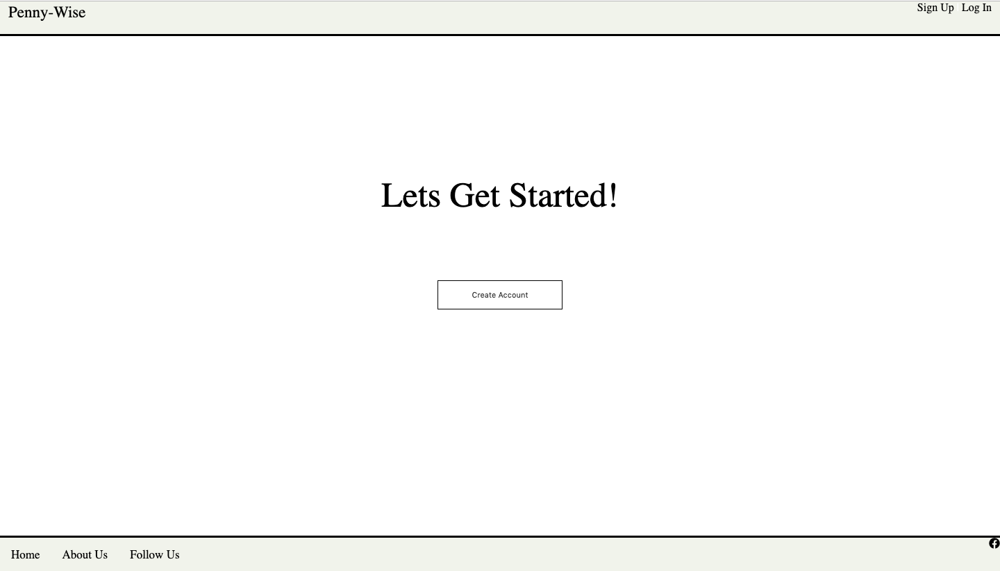
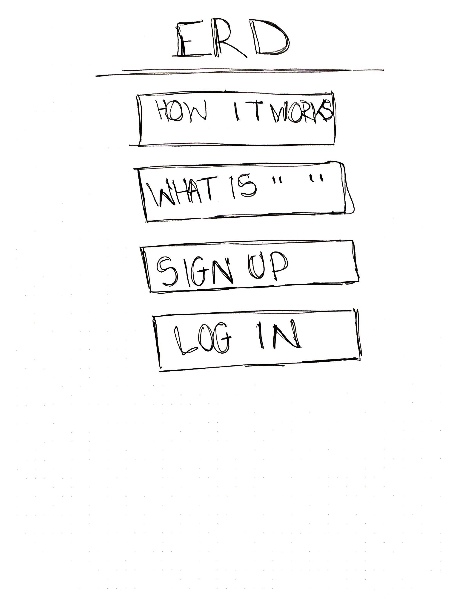
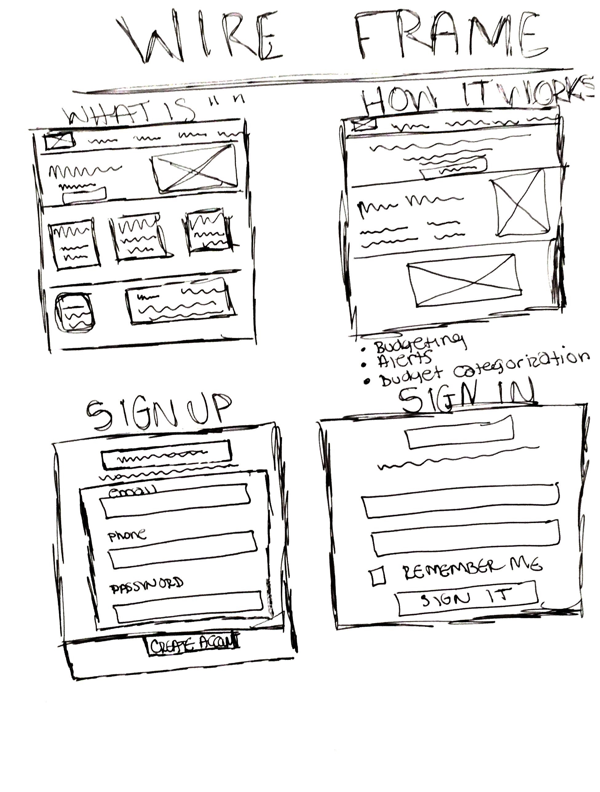

# Full-Stack-App

Expense Tracker App

General Assembly SEI December 18 - Project 2

[Heroku](https://mysterious-sierra-76184.herokuapp.com/)

[Trello Board](https://trello.com/b/N28D3yRy/project-2-full-stack-app)

[GitHub](https://github.com/dasianejones/Full-Stack-App)

OVERVIEW

Objective of this project was to use MongoDB, MVC, and Handlebars skills to create a functioning app that could be deployed via the cloud on Heroku. I created my own rendition of an Expense Tracker App based on how I would like to improve my spending habits.

ERD Picture

WIREFRAME

TECHNOLOGIES USED

. MongoDB

. MVC

. Handlebars

. HTML

. CSS

. Javascript

FUTURE DEVELOPMENTS/ IMPROVEMENTS

. Make more user friendly

. Add interactive web funtionality

.

.
